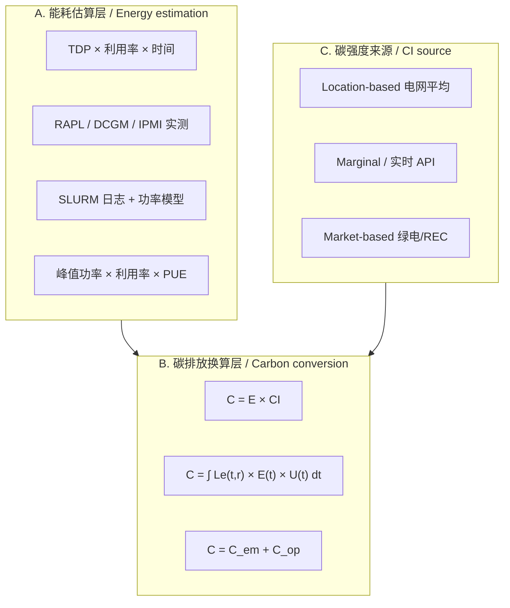

# HPC 碳强度与碳足迹计算方法文献整理
# Carbon intensity and carbon footprint methods in HPC: literature notes

> 项目：Energy and Carbon Monitoring in HPC Systems
> Project: Energy and Carbon Monitoring in HPC Systems
>
> 整理日期：2026-07-08
> Compiled: 2026-07-08
>
> 来源：导师推荐 9 篇 + 外部资源 11 篇，共 20 篇
> Sources: 9 supervisor papers + 11 external papers (20 total)

---

## 目录
## Contents

1. [比较矩阵](#比较矩阵)
2. [方法分类](#方法分类)
3. [导师推荐论文（9 篇）](#导师推荐论文9-篇)
4. [外部资源论文（11 篇）](#外部资源论文11-篇)
5. [对比小结](#对比小结)
6. [文献索引](#文献索引)

1. [Comparison matrix](#比较矩阵)
2. [Method families](#方法分类)
3. [Supervisor papers (9)](#导师推荐论文9-篇)
4. [External papers (11)](#外部资源论文11-篇)
5. [Cross-paper notes](#对比小结)
6. [Paper index](#文献索引)

---

## 比较矩阵
## Comparison matrix

符号：✅ 明确考虑 · ⚠️ 部分/间接 · ❌ 未考虑
Legend: ✅ explicit · ⚠️ partial/indirect · ❌ not covered

| 论文 Paper | 电力碳强度 Grid CI | PUE | CPU/GPU 功耗 CPU/GPU power | Runtime | Idle Power | Embodied Carbon | Location / Market CI |
|------|:----------:|:---:|:------------:|:-------:|:----------:|:---------------:|:--------------------------:|
| Li et al. 2023 (2306.13177) | ✅ 小时级 Hourly | ✅ 固定 Fixed | ✅ 实测 Measured | ✅ | ⚠️ | ✅ 全生命周期 Full lifecycle | ✅ Location |
| Lannelongue 2021 (Green Algorithms) | ✅ | ✅ | ✅ TDP×利用率 TDP × util | ✅ | ⚠️ | ❌ | ✅ Location |
| O'Brien 2017 (Power Survey) | ❌ | ⚠️ 综述 Survey only | ✅ 模型 Models | ✅ | ✅ 模型 Modeled | ❌ | ❌ |
| Czarnul 2019 (EA-HPC Survey) | ❌ | ⚠️ 工具 Tools cited | ✅ RAPL等 RAPL etc. | ✅ | ⚠️ | ❌ | ❌ |
| Liu & Zhai 2025 (CEM) | ✅ 可再生缺口率 Renewable deficit | ✅ η | ✅ 峰值功率 Peak power | ✅ 积分 Integrated | ⚠️ 利用率 Util factor | ✅ 全生命周期 Full lifecycle | ✅ Location |
| Veigas 2025 (Dashboard) | ⚠️ 间接 Indirect | ✅ 引用 Cited | ✅ 预测 Forecast | ✅ | ❌ | ❌ | ❌ |
| IEA-4E 2025 (DC Review) | ⚠️ 反算 Back-calculated | ✅ 区域 Regional | ⚠️ 聚合 Aggregated | ❌ | ❌ | ❌ 仅运营 Ops only | ⚠️ |
| Antici 2025 (F-DATA) | ⚠️ 可推算 Derivable | ❌ | ✅ 实测 Measured | ✅ | ✅ idle_time | ❌ | ❌ |
| Souter 2023 (10 Recs) | ✅ 实时API Live API | ⚠️ 工具 Tool-dependent | ⚠️ 工具 Tool-dependent | ✅ | ⚠️ | ⚠️ 存储 Storage | ✅ Location |
| Anthony 2020 (Carbontracker) | ✅ 实时/预测 Live/forecast | ❌ | ✅ RAPL/GPU | ✅ | ⚠️ | ❌ | ✅ Location |
| Lacoste 2019 (mlco2) | ✅ 区域 Regional | ✅ | ✅ GPU类型 GPU type | ✅ | ❌ | ❌ | ✅ Location + 云抵消 cloud offsets |
| Wassermann 2024 (User-centric) | ✅ 15min | ✅ iPUE | ✅ 实测 Measured | ✅ | ✅ 空闲归因 Idle to operator | ❌ 仅运营 Ops only | ✅ 两者 Both |
| West 2024 (Ichnos) | ✅ 时序 Time series | ⚠️ | ✅ 自定义功率模型 Custom power model | ✅ 任务级 Per task | ✅ | ❌ | ✅ Location |
| You 2023 (Zeus) | ❌ | ❌ | ✅ GPU功率限制 GPU power cap | ✅ | ⚠️ | ❌ | ❌ |
| Dodge 2022 (Cloud CI) | ✅ 边际强度 Marginal | ⚠️ | ✅ 云实例 Cloud SKU | ✅ | ❌ | ❌ | ✅ Location |
| Strubell 2019 (NLP Energy) | ✅ 区域 Regional | ⚠️ 云 Cloud | ✅ GPU/TPU | ✅ | ❌ | ❌ | ✅ Location |
| Gupta 2022 (ACT) | ✅ 电网 Grid | ⚠️ | ✅ 芯片级 Chip-level | ✅ 寿命 Lifetime | ❌ | ✅ 核心 Core focus | ✅ Location |
| Luccioni 2022 (BLOOM) | ✅ | ⚠️ | ✅ GPU | ✅ | ❌ | ✅ LCA | ✅ Location |
| Yang 2023 (Chase) | ✅ 低碳时段 Low-CI windows | ❌ | ✅ GPU | ✅ | ❌ | ❌ | ✅ Location |
| Chung 2024 (Perseus) | ⚠️ | ❌ | ✅ 多GPU Multi-GPU | ✅ | ⚠️ | ❌ | ❌ |

---

## 方法分类
## Method families

| 方法类型 Method | 代表论文 Examples | 典型公式 Typical formula | 精度 Accuracy | 实施难度 Effort |
|----------|----------|----------|------|----------|
| TDP 估算法 TDP estimate | Green Algorithms, mlco2 | `C = t×(nc×Pc×uc + nm×Pm)×PUE×CI×0.001` | 低–中 Low–mid | 低 Low |
| 实测功耗法 Measured power | Carbontracker, F-DATA | `C = ∫P(t)dt × CI(t)` | 高 High | 高 High |
| 峰值功率模型 Peak power model | Liu & Zhai CEM | `E_op = Σ(P_peak × N) × η` | 中 Mid | 中 Mid |
| 用户中心核时法 Per-core-hour | Wassermann 2024 | `CF = IT_Energy × PUE × ⟨Mix, EF⟩ / CoreHours` | 中–高 Mid–high | 高 High |
| 全生命周期法 Lifecycle | Li 2023, ACT, CEM | `C_total = C_em + C_op` | 高（长期） High (long term) | 很高 Very high |
| 工作流追踪法 Workflow trace | Ichnos | `C_task = E_task × CI(t_task)` | 中–高 Mid–high | 高 High |

---
## 导师推荐论文（9 篇）
## Supervisor papers (9)

---

### 1. Li et al. (2023) — Toward Sustainable HPC

| 属性 Field | 内容 Content |
|------|------|
| 文件 File | `论文/Toward Sustainable HPC - Carbon Footprint Estimation and Environmental Implications of HPC Systems.pdf` |
| 引用 Citation | arXiv:2306.13177, SC'23 |

> 把 HPC 碳足迹拆成制造阶段（embodied）和运行阶段（operational），在 Frontier、LUMI、Perlmutter 上用了小时级电网碳强度数据。
> Splits HPC carbon into embodied (manufacturing) and operational (runtime) parts, and applies hourly grid carbon intensity on Frontier, LUMI, and Perlmutter.

#### 计算方法
#### Calculation method

| 维度 Dimension | 内容 Content |
|------|------|
| 总公式 Total | `C_total = C_em + C_op` |
| Embodied | 处理器：`M_proc = (FPA + GPA + MPA) × A_die / Yield`；存储：`M_m/s = EPC × Capacity`；封装：`150g × N_IC` Processors: `M_proc = (FPA + GPA + MPA) × A_die / Yield`; storage: `M_m/s = EPC × Capacity`; packaging: `150g × N_IC` |
| Operational | `C_op = I_sys × E_op`，`E_op` 含 PUE，用 carbontracker 实测 `C_op = I_sys × E_op`; `E_op` includes PUE; measured via carbontracker |
| 输入数据 Inputs | 芯片 die area、厂商 sustainability report、Electricity Maps / UK ESO API 小时级 CI、benchmark 能耗 Die area, vendor sustainability reports, hourly CI from Electricity Maps / UK ESO API, benchmark energy |
| 假设 Assumptions | PUE 跨系统取常数；fab yield = 0.875；DRAM/SSD/HDD EPC 分别为 65/6.21/1.33 gCO₂/GB Fixed PUE across systems; fab yield = 0.875; DRAM/SSD/HDD EPC at 65/6.21/1.33 gCO₂/GB |
| 局限 Limits | PUE 没按时变；没区分 location/market-based；idle power 没单独建模 PUE not time-varying; no location vs market split; idle power not modeled separately |

#### 七因素覆盖
#### Seven-factor coverage

| 电力碳强度 Grid CI | PUE | CPU/GPU功耗 Power | Runtime | Idle Power | Embodied | Loc/Market CI |
|:----------:|:---:|:-----------:|:-------:|:----------:|:--------:|:-------------:|
| ✅ 小时级 Hourly | ✅ 固定 Fixed | ✅ 实测 Measured | ✅ | ⚠️ | ✅ | ✅ Location |

---

### 2. Lannelongue et al. (2021) — Green Algorithms

| 属性 Field | 内容 Content |
|------|------|
| 文件 File | `论文/Green Algorithms - Quantifying the Carbon Footprint of Computation.pdf` |
| 引用 Citation | *Advanced Science*, 8(12), 2100707 |

> 给出了一个可以直接套用的算法碳足迹公式和网页计算器，把 CPU/GPU 功耗、运行时间、PUE 和当地电网碳强度乘在一起。
> Provides a plug-in formula and web calculator: CPU/GPU power × runtime × PUE × local grid carbon intensity.

#### 计算方法
#### Calculation method

| 维度 Dimension | 内容 Content |
|------|------|
| 能耗公式 Energy | `E = t × (n_c × P_c × u_c + n_m × P_m) × PUE × 0.001` [kWh] |
| 碳排放公式 Carbon | `C = E × CI`；合并：`C = t × (n_c×P_c×u_c + n_m×P_m) × PUE × CI × 0.001` `C = E × CI`; combined form above |
| 输入数据 Inputs | 核心数、CPU/GPU TDP、利用率、内存功耗、数据中心 PUE、国家/地区 CI Core count, CPU/GPU TDP, utilisation, memory power, datacenter PUE, country/region CI |
| 假设 Assumptions | 默认全球 PUE=1.67、CI=475 gCO₂e/kWh；利用率缺失时用 100%；不算 embodied Defaults: PUE=1.67, CI=475 gCO₂e/kWh; 100% util if missing; no embodied term |
| 局限 Limits | 默认 PUE/CI 偏差大；不区分 idle/active；无 market-based Default PUE/CI can be off; no idle/active split; no market-based CI |

#### 七因素覆盖
#### Seven-factor coverage

| 电力碳强度 Grid CI | PUE | CPU/GPU功耗 Power | Runtime | Idle Power | Embodied | Loc/Market CI |
|:----------:|:---:|:-----------:|:-------:|:----------:|:--------:|:-------------:|
| ✅ | ✅ | ✅ | ✅ | ⚠️ | ❌ | ✅ Location |

---

### 3. O'Brien et al. (2017) — Power & Energy Predictive Models Survey

| 属性 Field | 内容 Content |
|------|------|
| 文件 File | `论文/A Survey of Power and Energy Predictive Models in HPC Systems and Applications.pdf` |
| 引用 Citation | *ACM Computing Surveys*, 50(3), Article 37 |

> 综述 HPC 功耗和能耗预测模型，覆盖 CPU、GPU、Xeon Phi、FPGA，本身不算碳，但给后面的碳估算提供了能耗侧的基础。
> Surveys HPC power/energy prediction models for CPUs, GPUs, Xeon Phis, and FPGAs. No carbon math, but useful as the energy side of later carbon estimates.

#### 计算方法
#### Calculation method

| 维度 Dimension | 内容 Content |
|------|------|
| 核心贡献 Main point | 分类综述功耗模型（组件级、应用级、分析级），不是碳排放计算 Taxonomy of component-, application-, and analytical-level power models; not carbon accounting |
| 典型模型 Examples | CPU: `P = P_static + P_dynamic(f,v)`；GPU: 性能计数器回归；应用级: 通信/计算比 CPU: `P = P_static + P_dynamic(f,v)`; GPU: perf-counter regression; app-level: comm/compute ratio |
| 输入数据 Inputs | 硬件规格、性能计数器、频率/电压、工作负载特征 Hardware specs, perf counters, frequency/voltage, workload traits |
| 假设 Assumptions | 模型精度依赖标定；不同架构要不同模型 Accuracy depends on calibration; architecture-specific models |
| 局限 Limits | 不涉及碳强度；不讨论 PUE/embodied；要二次开发才能用于碳核算 No CI conversion; no PUE/embodied; needs extra work for carbon use |

#### 七因素覆盖
#### Seven-factor coverage

| 电力碳强度 Grid CI | PUE | CPU/GPU功耗 Power | Runtime | Idle Power | Embodied | Loc/Market CI |
|:----------:|:---:|:-----------:|:-------:|:----------:|:--------:|:-------------:|
| ❌ | ⚠️ | ✅ | ✅ | ✅ | ❌ | ❌ |

---

### 4. Czarnul et al. (2019) — Energy-Aware HPC Survey

| 属性 Field | 内容 Content |
|------|------|
| 文件 File | `论文/Energy-Aware High-Performance Computing - Survey of State-of-the-Art Tools, Techniques, and Environments.pdf` |
| 引用 Citation | *Journal of Electrical and Computer Engineering*, 2019 |

> 整理了节能 HPC 的工具和环境，包括 Slurm 能耗插件、RAPL、DVFS，但没有给出碳足迹公式。
> Catalogues energy-aware HPC tools and environments (Slurm energy plugins, RAPL, DVFS) without a carbon footprint formula.

#### 计算方法
#### Calculation method

| 维度 Dimension | 内容 Content |
|------|------|
| 核心贡献 Main point | 工具分类（监控、调度、DVFS、仿真），不是碳核算 Tool taxonomy: monitoring, scheduling, DVFS, simulation; not carbon accounting |
| 相关能耗工具 Energy tools | Slurm `acct_gather_energy`, IPM, GEOPM, HPCToolkit, Extrae |
| 输入数据 Inputs | RAPL 计数器、作业调度日志、性能分析数据 RAPL counters, scheduler logs, profiling data |
| 局限 Limits | 无碳强度；无 PUE/embodied；要配合其他论文做碳换算 No CI; no PUE/embodied; carbon conversion needs other sources |

#### 七因素覆盖
#### Seven-factor coverage

| 电力碳强度 Grid CI | PUE | CPU/GPU功耗 Power | Runtime | Idle Power | Embodied | Loc/Market CI |
|:----------:|:---:|:-----------:|:-------:|:----------:|:--------:|:-------------:|
| ❌ | ⚠️ | ✅ | ✅ | ⚠️ | ❌ | ❌ |

---

### 5. Liu & Zhai (2025) — Carbon Emission Modeling (CEM)

| 属性 Field | 内容 Content |
|------|------|
| 文件 File | `论文/Carbon Emission Modeling for High-Performance Computing-Based AI in New Power Systems with Large-Scale Renewable Energy Integration.pdf` |
| 引用 Citation | *Processes*, 13(2), 595 |

> 针对含大量可再生能源的电力系统，建了 HPC 全生命周期碳排放模型 CEM；运营排放约占 87%，提高可再生比例能明显降碳。
> Builds a lifecycle HPC carbon model (CEM) for grids with high renewable share; operational emissions are ~87%; more renewables cut total carbon sharply.

#### 计算方法
#### Calculation method

| 维度 Dimension | 内容 Content |
|------|------|
| 总公式 Total | `C = C_em + C_op` |
| Embodied | `C_em = C_x + C_m + C_s + C_e + C_t + C_d`（芯片/内存/存储/设备/运输/部署） Chip, memory, storage, equipment, transport, deployment |
| Operational | `C_op = ∫₀ᵀ Le(t,r) × E_op(t) × U_o(t) dt` |
| 能耗 Energy | `E_op(t) = (Σ P_srv,i + Σ P_gpu,j + Σ P_net,k) × η` |
| 输入数据 Inputs | 芯片/内存/存储 embodied 系数、峰值功率、PUE(η)、可再生缺口率 Le、利用率 U_o(t) Embodied coeffs, peak power, PUE (η), renewable deficit Le, utilisation U_o(t) |
| 假设 Assumptions | 用峰值功率简化；PUE=1.5；Carbontracker 2.1.0 辅助参数；处置阶段 <0.1% 忽略 Peak power simplification; PUE=1.5; Carbontracker 2.1.0 for ops params; disposal <0.1% dropped |
| 局限 Limits | 峰值功率会高估动态负载；Le 参数化复杂；未区分 market-based Peak power overstates dynamic loads; Le is hard to parameterise; no market-based CI |

#### 七因素覆盖
#### Seven-factor coverage

| 电力碳强度 Grid CI | PUE | CPU/GPU功耗 Power | Runtime | Idle Power | Embodied | Loc/Market CI |
|:----------:|:---:|:-----------:|:-------:|:----------:|:--------:|:-------------:|
| ✅ | ✅ | ✅ | ✅ | ⚠️ | ✅ | ✅ Location |

---

### 6. Veigas et al. (2025) — HPC Data Center Dashboard

| 属性 Field | 内容 Content |
|------|------|
| 文件 File | `论文/Towards Energy Efficiency of HPC Data Centers - A Data-Driven Analytical Visualization Dashboard Prototype Approach.pdf` |
| 引用 Citation | *Electronics*, 14(16), 3170 |

> 给 CRESCO7 HPC 数据中心做了数字孪生仪表板，用 LightGBM 预测功耗和温度，间接减碳，但没有作业级碳核算公式。
> Digital twin dashboard for CRESCO7 using LightGBM to forecast power and temperature. Carbon reduction is indirect; no per-job carbon formula.

#### 计算方法
#### Calculation method

| 维度 Dimension | 内容 Content |
|------|------|
| 核心方法 Approach | 时序预测（功耗、温度、冷却），不是直接碳核算 Time-series forecasting for power, temperature, cooling; not direct carbon accounting |
| 碳关联 Carbon link | 通过能效提升间接减碳；引用 PUE 行业趋势 Carbon cut via efficiency gains; cites PUE trends |
| 输入数据 Inputs | 数据中心传感器时序、环境数据、HPC 集群运行指标 Sensor time series, environmental data, cluster runtime metrics |
| 假设 Assumptions | 碳减排靠能耗优化，没有 E→C 换算式 Assumes carbon follows energy savings; no E→C formula |
| 局限 Limits | 无碳强度输入；无作业级碳核算；无 embodied No CI input; no per-job carbon; no embodied |

#### 七因素覆盖
#### Seven-factor coverage

| 电力碳强度 Grid CI | PUE | CPU/GPU功耗 Power | Runtime | Idle Power | Embodied | Loc/Market CI |
|:----------:|:---:|:-----------:|:-------:|:----------:|:--------:|:-------------:|
| ⚠️ | ✅ | ✅ | ✅ | ❌ | ❌ | ❌ |

---

### 7. IEA-4E (2025) — Data Centre Energy Use Review

| 属性 Field | 内容 Content |
|------|------|
| 文件 File | `论文/Data Centre Energy Use - Critical Review of Models and Results.pdf` |
| 引用 Citation | IEA 4E, Paris, 2025 |

> 批判性回顾全球数据中心能耗模型，2023 年估计 300–380 TWh，重点在 bottom-up 和 aggregated totals 两种思路的差别。
> Critical review of global datacenter energy models; 2023 estimate 300–380 TWh; contrasts bottom-up vs aggregated-totals methods.

#### 计算方法
#### Calculation method

| 维度 Dimension | 内容 Content |
|------|------|
| 核心方法 Approach | 能耗模型综述（bottom-up、aggregated totals、extrapolation、hybrid） Survey of bottom-up, aggregated totals, extrapolation, hybrid models |
| 碳关联 Carbon link | 部分研究从 GHG 反算电力；只计运营能耗，不含生产/报废 Some GHG→electricity back-calculation; operational energy only |
| 典型公式 Formulas | `E_DC = E_IT × PUE`；`E_global = Σ E_region` |
| 输入数据 Inputs | 服务器出货量、PUE 假设、运营商报告、IP 流量代理 Server shipments, PUE assumptions, operator reports, traffic proxies |
| 局限 Limits | 非作业级；不讨论 embodied；碳强度只是间接涉及；AI 负载预测不确定性大 Not job-level; no embodied; CI only indirect; AI load forecasts uncertain |

#### 七因素覆盖
#### Seven-factor coverage

| 电力碳强度 Grid CI | PUE | CPU/GPU功耗 Power | Runtime | Idle Power | Embodied | Loc/Market CI |
|:----------:|:---:|:-----------:|:-------:|:----------:|:--------:|:-------------:|
| ⚠️ | ✅ | ⚠️ | ❌ | ❌ | ❌ | ⚠️ |

---

### 8. Antici et al. (2025) — F-DATA Dataset

| 属性 Field | 内容 Content |
|------|------|
| 文件 File | `论文/F-DATA - A Fugaku Workload Dataset for Job-centric Predictive Modelling in HPC Systems.pdf` |
| 引用 Citation | *Scientific Data*, 12, 5633 |

> 公开了 Fugaku 2600 万条作业数据，带 min/avg/max 功率、能耗（econ）、idle 时间和性能指标，可以用来反推作业碳足迹。
> Public dataset of 26M Fugaku jobs with min/avg/max power, energy (econ), idle time, and perf metrics for downstream carbon estimates.

#### 计算方法
#### Calculation method

| 维度 Dimension | 内容 Content |
|------|------|
| 数据字段 Fields | `avgpcon/minpcon/maxpcon`（W）、`econ`（Wh）、`idle_time_ave`、`duration` Power (W), energy (Wh), idle time, duration |
| 碳推算 Carbon estimate | `C_job ≈ econ × CI(location, time)`，需外部碳强度 Needs external CI |
| 性能公式 Perf formulas | `#flops = (perf2 + perf3×4) / duration`；`opint = #flops / mbwidth` |
| 输入数据 Inputs | 节点级实测功耗、作业资源分配、执行时长 Node-level measured power, allocation, runtime |
| 局限 Limits | 数据集本身不含碳强度；无 PUE 校正；无 embodied No built-in CI; no PUE correction; no embodied |

#### 七因素覆盖
#### Seven-factor coverage

| 电力碳强度 Grid CI | PUE | CPU/GPU功耗 Power | Runtime | Idle Power | Embodied | Loc/Market CI |
|:----------:|:---:|:-----------:|:-------:|:----------:|:--------:|:-------------:|
| ⚠️ | ❌ | ✅ 实测 Measured | ✅ | ✅ | ❌ | ❌ |

---

### 9. Souter et al. (2023) — Ten Recommendations for Neuroimaging

| 属性 Field | 内容 Content |
|------|------|
| 文件 File | `论文/Ten recommendations for reducing the carbon footprint of research computing in human neuroimaging.pdf` |
| 引用 Citation | University of Cambridge Repository, 2023 |

> 给神经影像研究列了十条减碳建议，建议用 Green Algorithms/Carbontracker 量化，并考虑按时段和地点调度到低碳电网。
> Ten practical tips for neuroimaging: quantify with Green Algorithms/Carbontracker and schedule work to low-carbon times and regions.

#### 计算方法
#### Calculation method

| 维度 Dimension | 内容 Content |
|------|------|
| 推荐工具 Tools cited | Green Algorithms、Carbontracker、MLCO2 |
| 时间维度 Time | UK Carbon Intensity API：峰谷差异可达 36.8%；夜间通常更低 UK CI API: up to 36.8% peak-to-trough; nights often lower |
| 空间维度 Location | 国家/州级 CI 差异（冰岛 28 vs 澳大利亚 712 gCO₂e/kWh） Country/state CI spread (Iceland 28 vs Australia 712 gCO₂e/kWh) |
| 存储碳 Storage | 长期存数据的隐性碳成本 Long-term storage has a carbon cost |
| 局限 Limits | 政策建议型，没有新公式；结果取决于第三方工具精度 Policy paper; no new formula; accuracy depends on cited tools |

#### 七因素覆盖
#### Seven-factor coverage

| 电力碳强度 Grid CI | PUE | CPU/GPU功耗 Power | Runtime | Idle Power | Embodied | Loc/Market CI |
|:----------:|:---:|:-----------:|:-------:|:----------:|:--------:|:-------------:|
| ✅ 实时 Live | ⚠️ | ⚠️ | ✅ | ⚠️ | ⚠️ 存储 Storage | ✅ Location |

---
