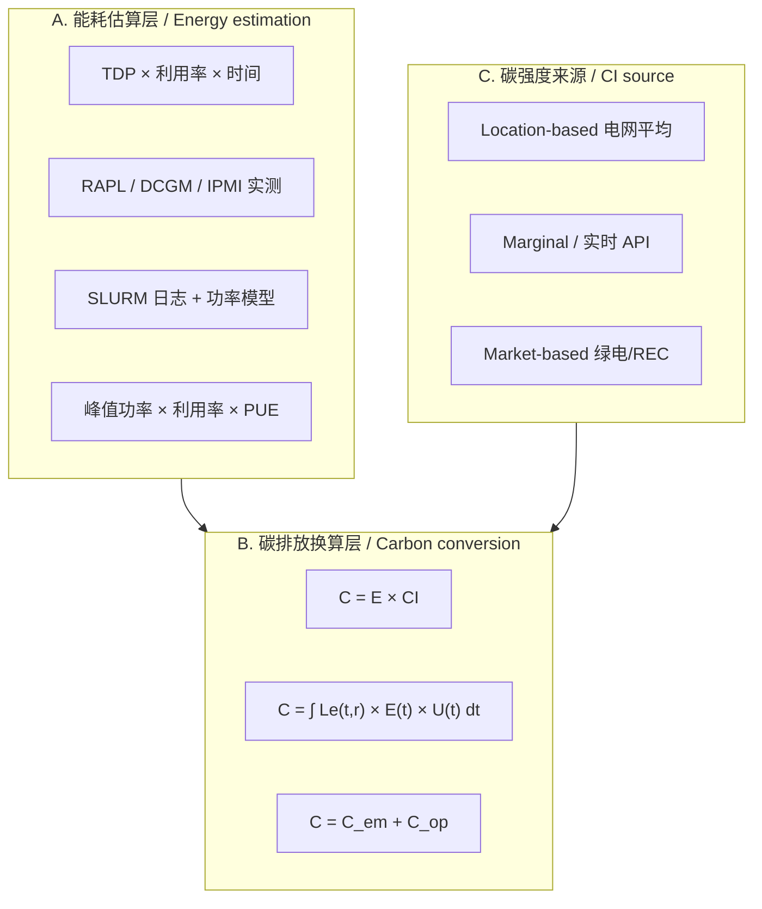

# HPC 碳强度与碳足迹计算方法文献整理
# Carbon intensity and carbon footprint methods in HPC: literature notes

> 项目：Energy and Carbon Monitoring in HPC Systems
> Project: Energy and Carbon Monitoring in HPC Systems
>
> 整理日期：2026-07-08
> Compiled: 2026-07-08
>
> 来源：导师推荐 9 篇 + 外部资源 11 篇，共 20 篇
> Sources: 9 supervisor papers + 11 external papers (20 total)

---

## 目录
## Contents

1. [比较矩阵](#比较矩阵)
2. [方法分类](#方法分类)
3. [导师推荐论文（9 篇）](#导师推荐论文9-篇)
4. [外部资源论文（11 篇）](#外部资源论文11-篇)
5. [对比小结](#对比小结)
6. [文献索引](#文献索引)

1. [Comparison matrix](#比较矩阵)
2. [Method families](#方法分类)
3. [Supervisor papers (9)](#导师推荐论文9-篇)
4. [External papers (11)](#外部资源论文11-篇)
5. [Cross-paper notes](#对比小结)
6. [Paper index](#文献索引)

---

## 比较矩阵
## Comparison matrix

符号：✅ 明确考虑 · ⚠️ 部分/间接 · ❌ 未考虑
Legend: ✅ explicit · ⚠️ partial/indirect · ❌ not covered

| 论文 Paper | 电力碳强度 Grid CI | PUE | CPU/GPU 功耗 CPU/GPU power | Runtime | Idle Power | Embodied Carbon | Location / Market CI |
|------|:----------:|:---:|:------------:|:-------:|:----------:|:---------------:|:--------------------------:|
| Li et al. 2023 (2306.13177) | ✅ 小时级 Hourly | ✅ 固定 Fixed | ✅ 实测 Measured | ✅ | ⚠️ | ✅ 全生命周期 Full lifecycle | ✅ Location |
| Lannelongue 2021 (Green Algorithms) | ✅ | ✅ | ✅ TDP×利用率 TDP × util | ✅ | ⚠️ | ❌ | ✅ Location |
| O'Brien 2017 (Power Survey) | ❌ | ⚠️ 综述 Survey only | ✅ 模型 Models | ✅ | ✅ 模型 Modeled | ❌ | ❌ |
| Czarnul 2019 (EA-HPC Survey) | ❌ | ⚠️ 工具 Tools cited | ✅ RAPL等 RAPL etc. | ✅ | ⚠️ | ❌ | ❌ |
| Liu & Zhai 2025 (CEM) | ✅ 可再生缺口率 Renewable deficit | ✅ η | ✅ 峰值功率 Peak power | ✅ 积分 Integrated | ⚠️ 利用率 Util factor | ✅ 全生命周期 Full lifecycle | ✅ Location |
| Veigas 2025 (Dashboard) | ⚠️ 间接 Indirect | ✅ 引用 Cited | ✅ 预测 Forecast | ✅ | ❌ | ❌ | ❌ |
| IEA-4E 2025 (DC Review) | ⚠️ 反算 Back-calculated | ✅ 区域 Regional | ⚠️ 聚合 Aggregated | ❌ | ❌ | ❌ 仅运营 Ops only | ⚠️ |
| Antici 2025 (F-DATA) | ⚠️ 可推算 Derivable | ❌ | ✅ 实测 Measured | ✅ | ✅ idle_time | ❌ | ❌ |
| Souter 2023 (10 Recs) | ✅ 实时API Live API | ⚠️ 工具 Tool-dependent | ⚠️ 工具 Tool-dependent | ✅ | ⚠️ | ⚠️ 存储 Storage | ✅ Location |
| Anthony 2020 (Carbontracker) | ✅ 实时/预测 Live/forecast | ❌ | ✅ RAPL/GPU | ✅ | ⚠️ | ❌ | ✅ Location |
| Lacoste 2019 (mlco2) | ✅ 区域 Regional | ✅ | ✅ GPU类型 GPU type | ✅ | ❌ | ❌ | ✅ Location + 云抵消 cloud offsets |
| Wassermann 2024 (User-centric) | ✅ 15min | ✅ iPUE | ✅ 实测 Measured | ✅ | ✅ 空闲归因 Idle to operator | ❌ 仅运营 Ops only | ✅ 两者 Both |
| West 2024 (Ichnos) | ✅ 时序 Time series | ⚠️ | ✅ 自定义功率模型 Custom power model | ✅ 任务级 Per task | ✅ | ❌ | ✅ Location |
| You 2023 (Zeus) | ❌ | ❌ | ✅ GPU功率限制 GPU power cap | ✅ | ⚠️ | ❌ | ❌ |
| Dodge 2022 (Cloud CI) | ✅ 边际强度 Marginal | ⚠️ | ✅ 云实例 Cloud SKU | ✅ | ❌ | ❌ | ✅ Location |
| Strubell 2019 (NLP Energy) | ✅ 区域 Regional | ⚠️ 云 Cloud | ✅ GPU/TPU | ✅ | ❌ | ❌ | ✅ Location |
| Gupta 2022 (ACT) | ✅ 电网 Grid | ⚠️ | ✅ 芯片级 Chip-level | ✅ 寿命 Lifetime | ❌ | ✅ 核心 Core focus | ✅ Location |
| Luccioni 2022 (BLOOM) | ✅ | ⚠️ | ✅ GPU | ✅ | ❌ | ✅ LCA | ✅ Location |
| Yang 2023 (Chase) | ✅ 低碳时段 Low-CI windows | ❌ | ✅ GPU | ✅ | ❌ | ❌ | ✅ Location |
| Chung 2024 (Perseus) | ⚠️ | ❌ | ✅ 多GPU Multi-GPU | ✅ | ⚠️ | ❌ | ❌ |

---

## 方法分类
## Method families

| 方法类型 Method | 代表论文 Examples | 典型公式 Typical formula | 精度 Accuracy | 实施难度 Effort |
|----------|----------|----------|------|----------|
| TDP 估算法 TDP estimate | Green Algorithms, mlco2 | `C = t×(nc×Pc×uc + nm×Pm)×PUE×CI×0.001` | 低–中 Low–mid | 低 Low |
| 实测功耗法 Measured power | Carbontracker, F-DATA | `C = ∫P(t)dt × CI(t)` | 高 High | 高 High |
| 峰值功率模型 Peak power model | Liu & Zhai CEM | `E_op = Σ(P_peak × N) × η` | 中 Mid | 中 Mid |
| 用户中心核时法 Per-core-hour | Wassermann 2024 | `CF = IT_Energy × PUE × ⟨Mix, EF⟩ / CoreHours` | 中–高 Mid–high | 高 High |
| 全生命周期法 Lifecycle | Li 2023, ACT, CEM | `C_total = C_em + C_op` | 高（长期） High (long term) | 很高 Very high |
| 工作流追踪法 Workflow trace | Ichnos | `C_task = E_task × CI(t_task)` | 中–高 Mid–high | 高 High |

---
